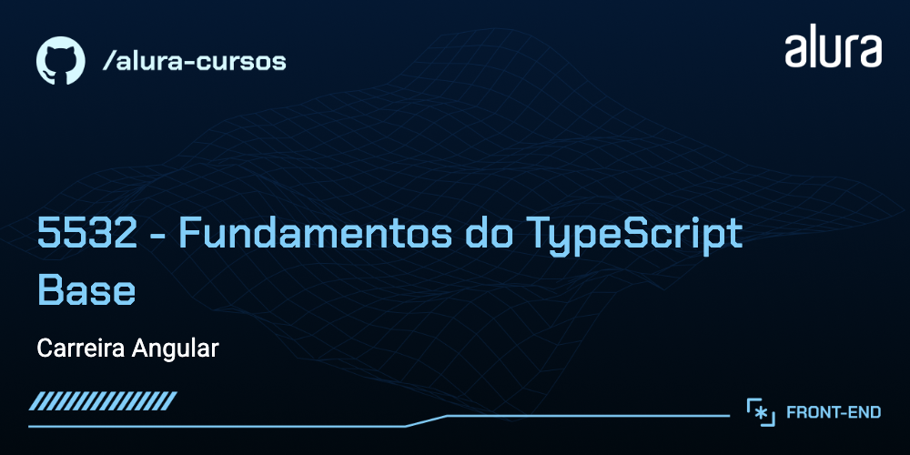

# Buscante

Página web para listagem de livros com um campo de busca para filtro desenvolvida para o curso de Fundamentos do TypeScript Base.

## 🔨 Funcionalidades do projeto

O App lista livros com uma imagem padrão, título, autor, data de publicação e editora. Também é possível filtrar os resultados, utilizando qualquer uma das informações do livro, digitando no campo de busca localizado logo no topo da página. Não temos armazenamento externo ou conexão com serviços terceiros, pois o foco do app é o Typescript.


## ✔️ Técnicas e tecnologias utilizadas

As técnicas e tecnologias utilizadas pra isso são:

- Ferramentas: `Angular, Angular CLI, Typescript e SCSS`!
- `App`: componente principal da aplicação
- `components/BookCard`: componente para renderização de livros dentro de um contâiner _Card_
- `components/Footer`: o rodapé básico da página
- `components/Header`: é padrão e contém o logo da aplicação e dois links
- `components/NoBooks`: componente exibido apenas quando o filtro digitado pelo usuário não encontra nenhum resultado
- `components/SearchBox`: o campo de busca da página
- `.cursor, .gemini, .windsurf`: arquivos configuráveis para extrair o máximo poder da IA com boas práticas de Angular

## 🎯 Desafio

Desenvolver novas funcionalidades:

Se desejar continuar dando vida para essa aplicação e tornando-a ainda mais robusta, o [Figma dessa aplicação você encontra aqui](https://www.figma.com/design/SpdkXTtIYkPi1BhaPc0SV0/Buscante--Acervo---fa%C3%A7a-uma-c%C3%B3pia-?node-id=19-159&t=A2fdGrqutPjm8jCF-0).

## 📁 Acesso ao projeto

Você pode [acessar o código fonte do projeto inicial](https://github.com/joaodos3v/5532-typescript-books/tree/projeto-base) ou [baixá-lo](https://github.com/joaodos3v/5532-typescript-books/archive/refs/heads/projeto-base.zip).

## 🛠️ Abrir e rodar o projeto

Após baixar o projeto, você pode abrir ele no seu editor favorito (ex: Visual Studio Code). Feito isso, abra o terminal e execute:

```bash
npm start
# ou
ng serve
```

## 📚 Mais informações do curso

Gostou do projeto e quer conhecer mais? Você pode [acessar as carreiras da Alura.](https://www.alura.com.br/carreiras) Aproveite!
